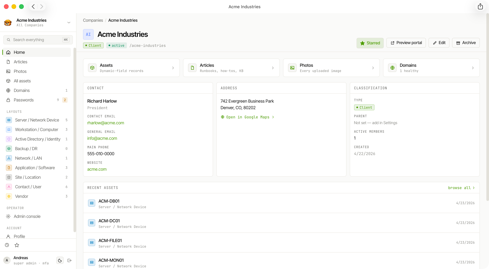

<div align="center">


</div>

# Weavestream

**Open-source, self-hosted IT documentation and relationship management platform.**
_Manage assets, credentials, domains, networks, vendors, procedures, and the relationships between them — all under your control._

[](LICENSE)
[](https://github.com/Weavestream/Weavestream/actions/workflows/ci.yml)
[](https://github.com/Weavestream/Weavestream/actions/workflows/release.yml)
[](https://weavestream.io)


---

→ **Full feature docs and guides at [docs.weavestream.io](https://docs.weavestream.io)**

Weavestream is a self-hosted platform for managing IT operations knowledge.

Assets, passwords, domains, IP networks, vendors, contacts, procedures, and documentation live in a connected system instead of isolated records.

Built for MSPs, internal IT teams, and homelabs, Weavestream helps you understand not just what you have, but how everything relates.



## Documentation with Context

Most documentation systems store information as pages.

Weavestream stores relationships.

A firewall can be linked to:
- its credentials
- public IPs
- domains
- SSL certificates
- ISP information
- support contacts
- procedures
- related assets

The result is documentation that behaves like a connected system instead of a collection of notes.

## Why Weavestream?

- **Connected documentation.** Assets, credentials, domains, vendors, contacts, and procedures are linked together so context is never lost.
- **Built for IT operations.** Designed for MSPs, internal IT teams, and homelabs—not generic note-taking.
- **Self-hosted and open source.** Your data stays under your control.
- **Modern and extensible.** Docker-first deployment, OpenAI-compatible AI integrations, and a growing ecosystem of integrations.

## Highlights

- **Connected documentation.** Markdown and rich-text articles, folders, photo
  galleries, and configurable asset layouts per organization.
- **Password management.** AES-256-GCM encrypted credential storage with
  TOTP support, breach detection, and role-based access control.
- **IP Address Management (IPAM).** Manage IPv4 subnets, track utilization,
  detect conflicts with asset IP fields, and expose network data to clients.
- **Domain & SSL monitoring.** WHOIS expiry, DNS health, and TLS certificate
  validity checks with aggregated expiration dashboards.
- **Expiration tracking.** Monitor asset expiration dates (licenses,
  warranties, SSL certificates, passwords) with visibility into upcoming renewals.
- **AI Chat.** Ask questions, draft documentation, and edit articles directly from a persistent chat panel. Powered by any OpenAI-compatible LLM you configure.
- **Alert system.** Email notifications for expirations, website downtime,
  and record lifecycle events with flexible scheduling.
- **Security Center.** Admin dashboard for login activity, active sessions,
  lockouts, rate-limit blocks, and egress attempt monitoring.
- **Integrations.** Sync inventory from external platforms (Action1, UniFi)
  into tenant asset records on demand or on a schedule.
- **Invite-only user management** with per-user setup tokens, forced
  TOTP MFA, IP-based access rules, and append-only audit logging.
- **Two-layer RBAC.** Global roles combined with per-tenant memberships
  evaluated from a single permission matrix.
- **Customer portals.** Each tenant gets a read-only portal where client
  users see only the articles, assets, passwords, and domains their role allows.
- **Local file storage.** Tenant files live on a shared host-mounted
  filesystem path with per-tenant directory isolation.
- **Docker-first.** Three containers (`api`, `web`, `worker`) plus
  Postgres and Redis. Pulled, not built.

See the [architecture docs](https://docs.weavestream.io/overview/architecture/) for the topology,
RBAC model, storage layout, terminology system, and repo layout.

## Quickstart

```bash
# Grab the compose file and env template
curl -O https://raw.githubusercontent.com/Weavestream/Weavestream/main/compose.yml
curl -O https://raw.githubusercontent.com/Weavestream/Weavestream/main/.env.example
mv .env.example .env

# Generate random keys (macOS/Linux/WSL)
curl https://raw.githubusercontent.com/Weavestream/Weavestream/main/scripts/keygen.sh | bash >> .env

# Start everything
docker compose up -d

# Create the first admin
docker compose exec api node dist/cli.js create-admin
```

Open <http://localhost:3000/login> and sign in. On Windows, use
[`scripts/keygen.ps1`](scripts/keygen.ps1) instead.

Full deployment walkthrough — pinning a version, upgrades, reverse-proxy/TLS,
backups — in the [deployment docs](https://docs.weavestream.io/deployment/).

Full guided walkthrough on the docs site: [docs.weavestream.io/getting-started](https://docs.weavestream.io/getting-started/)

## Documentation

| Guide                                         | Audience          |
| --------------------------------------------- | ----------------- |
| [Quickstart](https://docs.weavestream.io/getting-started/quickstart/) | Operators         |
| [Deployment docs](https://docs.weavestream.io/deployment/) | Operators         |
| [Configuration docs](https://docs.weavestream.io/configuration/) | Operators         |
| [Architecture docs](https://docs.weavestream.io/overview/architecture/) | Operators + devs  |
| [Development setup](https://docs.weavestream.io/development/) | Contributors      |
| [Releasing docs](https://docs.weavestream.io/development/releasing/) | Maintainers       |
| [Changelog](https://docs.weavestream.io/overview/changelog/) | Everyone          |
| [docs.weavestream.io/getting-started](https://docs.weavestream.io/getting-started/) | New operators |
| [docs.weavestream.io/features/assets](https://docs.weavestream.io/features/assets/) | Everyone |
| [docs.weavestream.io/features/passwords](https://docs.weavestream.io/features/passwords/) | Everyone |
| [docs.weavestream.io/features/articles](https://docs.weavestream.io/features/articles/) | Everyone |
| [docs.weavestream.io/features/ipam](https://docs.weavestream.io/features/ipam/) | Everyone |
| [docs.weavestream.io/features/integrations](https://docs.weavestream.io/features/integrations/) | Everyone |
| [docs.weavestream.io/guides/security-center](https://docs.weavestream.io/guides/security-center/) | Everyone |

## Project status

Use `:latest` to try the newest release quickly. For production, pin
`WEAVESTREAM_VERSION` in your `.env` so upgrades are deliberate and
repeatable. See the
[releases page](https://github.com/Weavestream/Weavestream/releases) and
[changelog](https://docs.weavestream.io/overview/changelog/) for published
images, upgrade notes, and release history.

## Contributing

Bug reports, feature requests, and PRs are welcome. Please read
[CONTRIBUTING.md](CONTRIBUTING.md) first, and remember that
contributions are accepted under the project's AGPL-3.0 license.

Security issues go through [SECURITY.md](SECURITY.md), not the public
issue tracker.

See also [docs.weavestream.io/security/disclosure](https://docs.weavestream.io/security/disclosure/).

## License

Weavestream is distributed under the **GNU AGPL-3.0-or-later** license
— see [LICENSE](LICENSE). If you run a modified Weavestream as a
network-accessible service, AGPL §13 requires you to offer the modified
source to its users.
