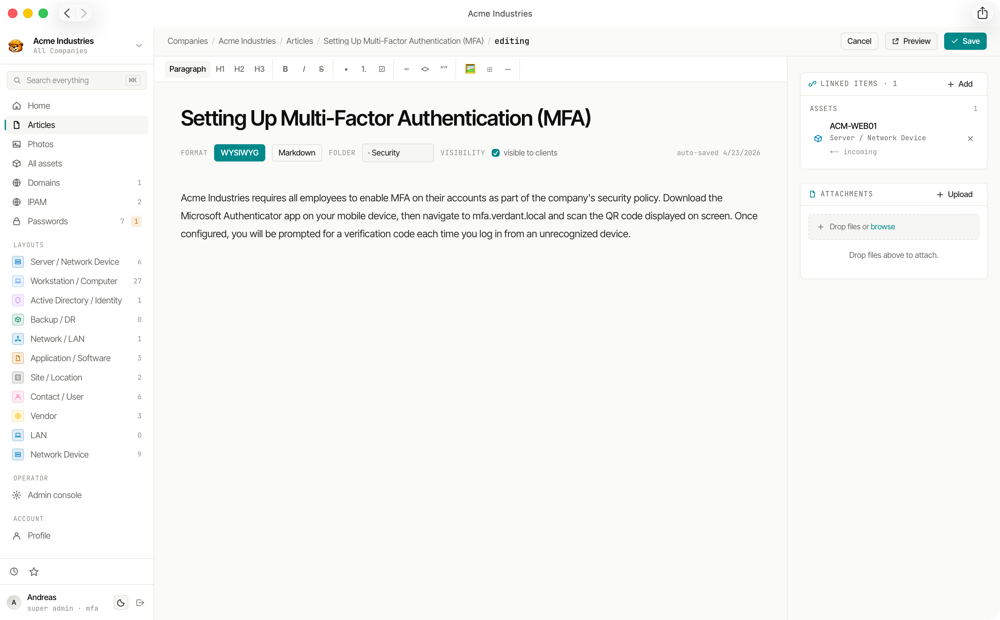

# Documentation (Articles)

Weavestream's documentation system lets you build a rich knowledge base for each tenant. Articles are authored in either a **WYSIWYG rich-text editor** (Tiptap) or **raw Markdown** — chosen per article — and organised into a searchable folder hierarchy.

## Editor Modes

Each article stores an `editor_mode` that determines how it is authored and rendered:

| Mode | Description |
|---|---|
| **WYSIWYG (Tiptap)** | Full rich-text editor with toolbar. Content stored as Tiptap/ProseMirror JSON. |
| **Markdown** | Raw Markdown source authored in a plain-text editor. Content stored as `markdown_source`. |

You switch modes from the article form using the **format toggle**. Switching an existing article triggers a one-time conversion with a confirmation dialog, since the transformation is potentially lossy (e.g. complex Tiptap nodes may not round-trip perfectly to Markdown and back). After switching, the article is saved explicitly — the format toggle does not autosave.

Search always indexes `content_plaintext` regardless of mode, so both formats are equally discoverable.

## Rich-Text Editing

Articles in Tiptap mode are powered by **Tiptap 3**, a headless editor built on ProseMirror. The editor supports:

| Content type | Description |
|---|---|
| Headings | H1 – H6 |
| Paragraphs | Plain text with inline formatting (bold, italic, underline, strikethrough, code) |
| Tables | Resizable, nestable table editor |
| Images | Inline image uploads from the tenant's file store |
| Code blocks | Syntax-highlighted fenced code blocks |
| Task lists | Interactive checkbox lists |
| Links | Inline hyperlinks |
| Horizontal rules | Visual section dividers |
| Block quotes | Callout-style quotes |

## Folder Hierarchy

Articles are organised into **Folders** per tenant. Folders can be nested to any depth, creating a tree structure you can browse via the sidebar.

- Create, rename, and delete folders from the article list view
- Move articles between folders
- An article can exist at the root level (no folder) or inside any folder

## Visibility Control

Each article has a `visibleToClients` flag:

- **Internal (default)** — visible only to operators and super admins
- **Client-visible** — also appears in the [client portal](/features/client-portal/) for that tenant's client users

This lets you maintain a private knowledge base and selectively expose relevant articles to your clients without maintaining separate content.

## Markdown Authoring

When an article is in Markdown mode, a plain-text editor replaces the Tiptap toolbar. Standard CommonMark Markdown is supported along with GitHub Flavored Markdown (GFM) extensions:

- Fenced code blocks with language hints
- Tables (`| col | col |`)
- Task lists (`- [ ] item`)
- Strikethrough

The raw Markdown is stored in `markdown_source` and rendered to HTML at read time.

## Search

Article content is indexed in the `SearchIndex` table for full-text search via PostgreSQL `tsvector`. Titles are weighted higher than body content. Results are scoped to the requesting user's accessible tenants.

Articles are discoverable via:

- The **command palette** (Cmd+K)
- The per-tenant article list with browser-native find
- The `/api/search` endpoint

## AI Editing

When the **AI chat panel** is open and an article is the active document, the AI has write access to that article. You can ask the AI to:

- Rewrite or expand sections
- Fix formatting or grammar
- Add structured content (tables, lists)
- Draft new sections from bullet notes

Proposed edits appear as **tool-call cards** in the chat — review the proposed change before accepting or discarding it. Accepted edits are applied directly; the editor reflects the change immediately.

Chat responses can also be **saved as a new article** via the "Save as article" action at the bottom of any assistant message, letting you capture AI-drafted content as a fresh article in any folder.

See [AI Chat](/features/ai-chat/) for setup and configuration.
