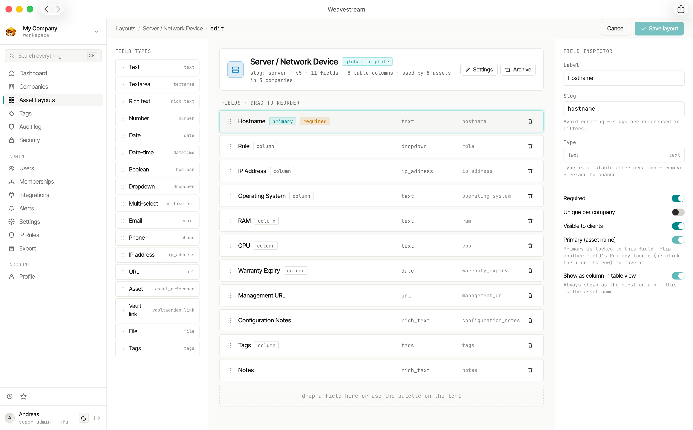

# Asset Management

Weavestream's asset system lets you build structured records for any kind of infrastructure. You define the fields, and every tenant's assets conform to that schema.

## Asset Layouts

An **Asset Layout** is a global template — think of it as a form definition. Each layout has a name, an optional icon, and a list of fields. Layouts are managed by `SUPER_ADMIN` users and shared across all tenants.

Examples of layouts you might create:

- **Server** — hostname, IP address, operating system, CPU, RAM, warranty expiry
- **Workstation** — assigned user, serial number, purchase date, warranty date
- **Software License** — product name, vendor, seat count, license key, renewal date
- **Network Device** — make, model, firmware version, management IP, location
- **SSL Certificate** — domain, issuer, expiry date, notes

### Layout management

- **Rename** layouts in place without affecting existing assets
- **Archive** layouts to hide them from the creation picker while preserving historical records
- **Drag-and-drop** field reordering within the layout builder
- **Sidebar sections** with custom positioning for grouping related fields

## Field Types

Each layout can contain any combination of the following field types:

| Type | Description | Notes |
|---|---|---|
| `TEXT` | Single-line plain text | — |
| `TEXTAREA` | Multi-line plain text | — |
| `RICH_TEXT` | Tiptap rich-text editor | Tables, images, code blocks |
| `NUMBER` | Numeric value | — |
| `DATE` | Calendar date | Supports expiry tracking |
| `DATETIME` | Date and time | Supports expiry tracking |
| `EMAIL` | Email address | Renders as `mailto:` link |
| `PHONE` | Phone number | — |
| `URL` | Hyperlink | — |
| `BOOLEAN` | Yes / No toggle | — |
| `DROPDOWN` | Single-select from predefined options | Optional free-text "Other…" escape hatch |
| `MULTISELECT` | Multiple selections from predefined options | Drag-and-drop option reordering |
| `IP_ADDRESS` | IPv4 or IPv6 address, optional CIDR | Groundwork for IPAM |
| `FILE` | Document or image upload | — |
| `ASSET_REFERENCE` | Cross-link to another asset | Creates a `Relation` record |

## Field Options

Each field supports additional configuration:

| Option | Description |
|---|---|
| **Primary field** | Highlighted in list and table views |
| **Show in table** | Controls column visibility in asset list tables |
| **Visible to clients** | Whether the field appears in the client portal |
| **Expiry tracking** | `DATE` and `DATETIME` fields — enables countdown and colour-coded status |
| **Unique per company** | Enforces uniqueness of the field value within a tenant |

## Asset Records

Each **Asset** is a single instance of a layout within a tenant. Assets support:

- **Soft-archive** — remove from active lists while preserving the full historical record
- **External ID tracking** — for synchronising with external systems
- **Embedded passwords** — link credentials directly to an asset; they archive when the asset is archived
- **Cross-references** — `ASSET_REFERENCE` fields create navigable links between assets

## Expiration Tracking

`DATE` and `DATETIME` fields with expiry tracking enabled appear in the global **Expirations** dashboard (`/admin/expirations`). Cells are colour-coded:

- **Green** — within a healthy window
- **Amber** — approaching expiry
- **Red** — expired

This lets you surface warranty expirations, license renewals, and certificate deadlines across all tenants at a glance.

## Search

All asset field values are indexed in the `SearchIndex` table for full-text search via the [command palette](/features/search/) and the `/api/search` endpoint. Results are scoped to the requesting user's accessible tenants.
