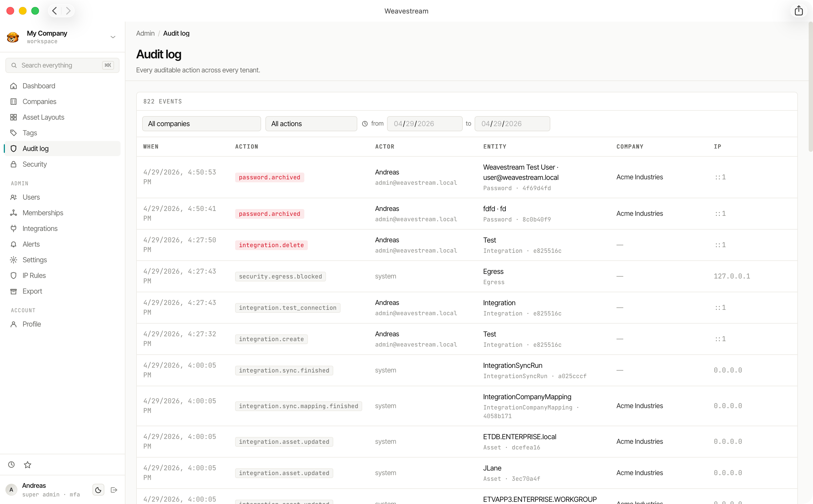

# Audit & Compliance

Weavestream maintains an append-only audit log of every mutation in the system. The log is tamper-resistant at the database-role level and accessible to `SUPER_ADMIN` users via a filterable, paginated UI.

## What Gets Logged

Every create, update, delete, archive, and restore operation writes an audit entry. Each entry captures:

| Field | Description |
|---|---|
| Actor | The user who performed the action |
| Action | The operation type (e.g. `create`, `update`, `delete`, `archive`) |
| Entity type | The kind of record affected (e.g. `Asset`, `Password`, `Company`) |
| Entity ID | The specific record's ID |
| Company | The tenant the record belongs to |
| IP address | The actor's IP at the time of the request |
| User agent | The browser or client that made the request |
| Before | JSON snapshot of the record before the change |
| After | JSON snapshot of the record after the change |
| Timestamp | UTC timestamp of the event |

For sensitive operations (password reveals, credential access), the before/after blobs contain metadata only — plaintext secrets are never written to the audit log.

## Tamper Protection

The audit table is protected at the **Postgres database-role level**:

- The application's database role has `INSERT`-only access to the audit table — no `UPDATE` or `DELETE`.
- Rewriting or deleting audit history requires direct Postgres superuser access — it cannot be done through the Weavestream API or admin UI.

This means even a fully compromised operator account cannot cover its tracks.

## Audit UI

The audit log is accessible at `/admin/audit` for `SUPER_ADMIN` users. Features:

- **Server-side cursor pagination** — efficient for very large audit tables
- **URL-sticky filters** — filter by date range, actor, action type, and entity type; filters persist in the URL for sharing and bookmarking
- **Configurable page size**
- **Before/after diff view** — expandable JSON diffs for each entry

## Password Reveal Audit

Password decryptions are a special audit category. Every time a credential's secret is revealed to a user, a `reveal` audit entry is written with the actor, timestamp, IP, and password ID. This creates a complete access trail separate from the general audit log.

## Retention

Audit records are never deleted or archived by the application. Retention management (e.g. partitioning old entries to cold storage) is left to the operator as a database-level operation.

## Compliance Use Cases

The audit log and security model support several common compliance requirements:

| Requirement | How Weavestream addresses it |
|---|---|
| Change history | Every mutation logged with before/after state |
| Access control | Two-layer RBAC with per-tenant scoping |
| Privileged access monitoring | Password reveal audit trail |
| Tamper-evident logs | DB-role-level append-only protection |
| Session tracking | IP, user-agent, and revocation per session |
| MFA enforcement | Forced TOTP on every account |
