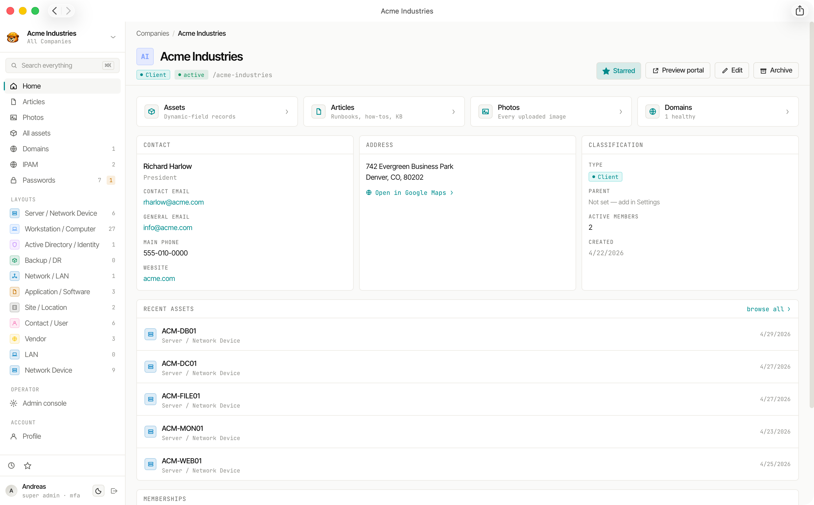

# Company Management

Each **Company** (or Client, Department, Site — whatever terminology your workspace uses) is the top-level container for all tenant data. Company records store contact information, address details, notes, and a logo.

## Company Record Fields

| Field | Description |
|---|---|
| Name | Display name |
| Slug | URL-safe identifier (auto-generated, editable) |
| Type | `CLIENT`, `PROSPECT`, `VENDOR`, `INTERNAL`, `PARTNER`, or `OTHER` |
| Notes | Rich-text freeform notes |
| Quick notes | Short plain-text notes shown in the list view |
| Contact name, title, email, phone | Primary point of contact |
| General email, phone, fax, website | General contact details |
| Address | Street lines, city, region, postal code, country |
| Logo | One uploaded image per company |
| Parent | Optional parent company (hierarchy) |
| Sticky note | Optional banner (plain text, up to 300 characters) with **Info**, **Warning**, or **Critical** severity; when set, shown at the top of admin pages for this company |

## Company Types

The `type` field classifies tenants for filtering and reporting:

| Type | Typical use |
|---|---|
| `CLIENT` | External paying customer |
| `PROSPECT` | Sales pipeline |
| `VENDOR` | Supplier or service provider |
| `INTERNAL` | Your own organisation |
| `PARTNER` | Business partner |
| `OTHER` | Catch-all |

## Parent-Child Hierarchy

Companies can be nested under a parent company to model organisational structure (e.g. a corporate parent with subsidiary sites). Cycle prevention is enforced — a company cannot be its own ancestor.

## Starred Companies

Operators can **star** companies to pin them to their personal dashboard. Starred companies appear prominently in the navigation for quick access.

## Sticky notes

Each company can have a **sticky note**: a short reminder that stays visible while you work in that tenant’s admin area. Configure it under **Company → Settings**, in the **Sticky note** panel:

- **Severity** — **Info**, **Warning**, or **Critical** (banner colour and emphasis; Critical is announced to screen readers as an alert).
- **Message** — Plain text only (no rich formatting), maximum 300 characters. Leave it empty to hide the banner.

When a message is set, it appears as a coloured strip above the breadcrumbs on every admin page for that company, scroll-pinned with the header so the note and navigation stay together.

## Configurable Terminology

The word "Company" is the default terminology but can be changed workspace-wide from **Admin → Settings**. Common alternatives:

- Client (MSP use case)
- Department (internal IT)
- Tenant (multi-tenanted SaaS)
- Site (physical locations)
- Organisation
- Custom (any term)

The terminology change is cosmetic — URL routes, API paths, and database columns remain `company` / `companies` regardless of the configured term.

## Related Data

Every company is the parent of:

- [Articles & Folders](/features/articles/)
- [Assets](/features/assets/)
- [Passwords](/features/passwords/)
- [Monitored Domains](/features/domains/)
- [File Uploads](/features/files/)
- [Memberships](/features/users/) (who has access)
