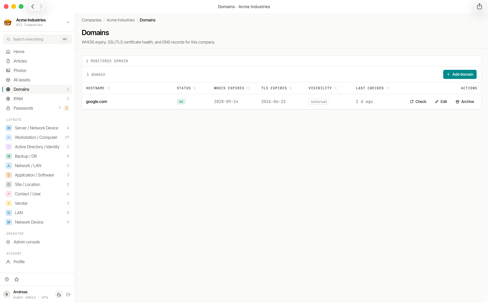

# Domain & SSL Monitoring

Weavestream monitors the health and expiry of any hostname you add. Checks run automatically in the background via the worker and results are aggregated in expiration dashboards.

## What Gets Checked

Each **Monitored Domain** runs three independent checks:

| Check | What it verifies |
|---|---|
| **WHOIS expiry** | Domain registration renewal deadline |
| **DNS validity** | Whether the hostname resolves correctly |
| **TLS/SSL expiry** | Certificate expiry date and chain validity |

Each check produces a status:

- **OK** — healthy, within threshold
- **WARN** — approaching the configured expiry threshold
- **FAIL** — expired or invalid
- **SKIP** — check disabled or not applicable

## Alert Thresholds

Each check has a configurable **days-before-expiry** threshold. When a domain crosses the threshold, its status changes to `WARN`. Set tighter thresholds for critical domains and looser ones for low-priority hostnames.

## Domain Check History

Check results are stored as immutable `DomainCheck` records — one per check run per domain. This creates an append-only history you can review to understand how a domain's health changed over time.

## Expiration Dashboard

Domain expirations (both WHOIS and TLS) roll up into the **Expirations** view at:

- **Global** — `/admin/expirations` — all domains across all tenants
- **Per-tenant** — `/admin/companies/[id]/expirations` — domains for a single tenant

The dashboard also includes asset expiry dates and password expiry dates for a unified view of upcoming renewals.

## Client Portal Visibility

Domains can be marked `visibleToClients`. When enabled, the domain and its check history appear in the [client portal](/features/client-portal/) for that tenant's client users.

## Background Processing

Domain checks run via BullMQ in the `worker` service. The schedule is configurable and checks are distributed across workers if you run multiple replicas.
