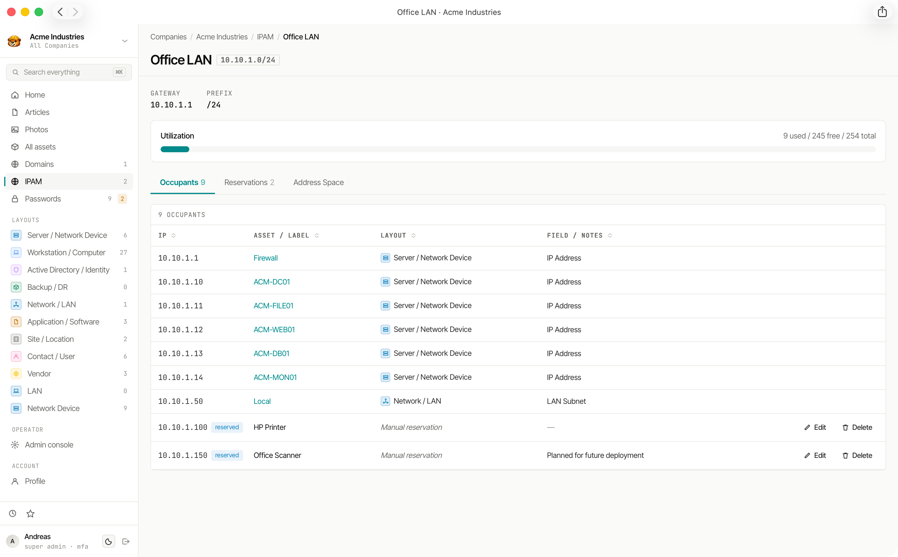

# IP Address Management (IPAM)

Weavestream includes built-in, tenant-scoped IPv4 IPAM so teams can track subnet usage without leaving their documentation system.

## What IPAM does

- Manage per-company subnets with name, CIDR, optional VLAN, gateway, and notes
- Auto-discover occupied addresses from asset fields of type `IP_ADDRESS`
- Support manual reservations for infrastructure that is not represented as a full asset record
- Detect and highlight conflicts when multiple assets share the same IP
- Show utilization (`used / free / total usable`) for each subnet

## Subnet Management

Admin users with write access to the company can:

- Create, edit, archive, and restore subnets
- Search/filter subnet lists and optionally include archived subnets
- Navigate to subnet detail pages with utilization, conflicts, and occupancy context

Each subnet enforces normalized IPv4 CIDR input and uniqueness within the same company.

## Occupants and Reservations

The subnet detail view combines two data sources:

1. **Occupants (auto-discovered):** assets whose `IP_ADDRESS` field falls inside the subnet range
2. **Reservations (manual):** named IP holds for devices or services not modeled as assets yet

Reservation writes are validated in real time and server-side:

- IP must be valid IPv4
- IP must be inside the target subnet
- IP must be unique within the subnet's reservation set

## Address Space View

Each subnet includes an address-space view that marks addresses as:

- Free
- Asset-occupied
- Reserved
- Conflict
- Network/broadcast (for prefixes `/30` and larger)

For very large ranges, IPAM automatically switches to a compact assigned-address list instead of rendering a full grid.

## Client Portal Visibility

IPAM is also available in the client portal as a read-only experience:

- Subnet list with utilization and conflict indicators
- Per-subnet detail view of occupants, reservations, and address space

## Permissions and Scope

- Read operations require `asset.read` within the company
- Write operations require `asset.write` within the company
- Data is tenant-scoped by company

## Auditability

Subnet and reservation mutations are written to the audit log, including create/update/archive/restore for subnets and create/update/delete for reservations.
