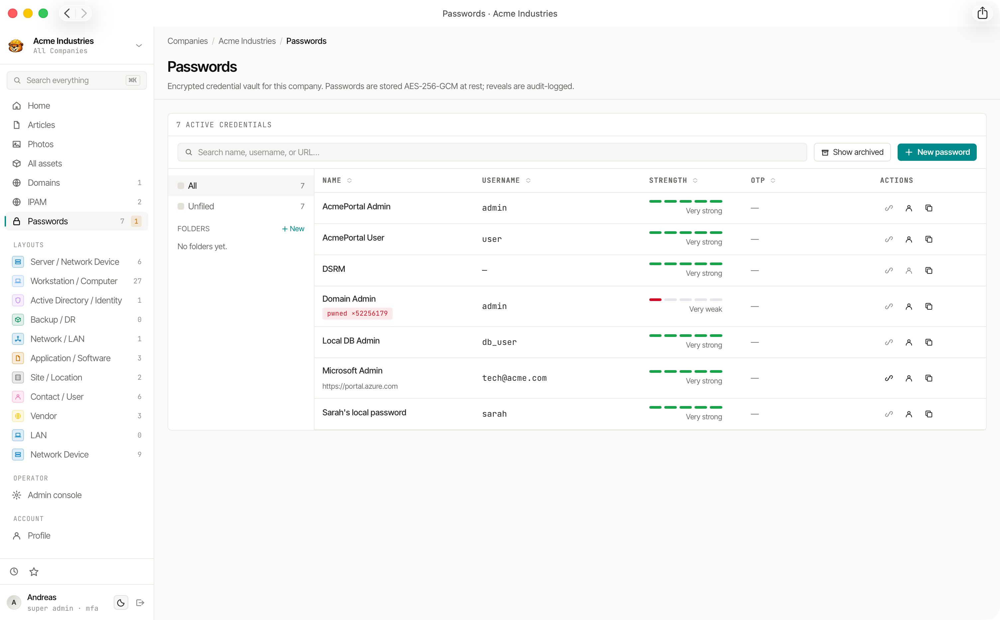

# Password Vault

Weavestream includes a full-featured password vault per tenant. Credentials are encrypted at rest, version-controlled, and protected by role-based access — without any dependency on an external secrets manager.

## Credential Storage

Each **Password** record stores:

| Field | Description |
|---|---|
| Name | Human-readable label |
| Username | Associated login name |
| URL | Associated service URL |
| Secret | The password — AES-256-GCM encrypted at rest |
| TOTP | Time-based one-time password secret — encrypted |
| Notes | Rich-text or plain-text notes — encrypted |
| Tags | Colour-coded organisational labels |
| Expiry date | Optional renewal deadline |
| Folders | Hierarchical folder grouping |

The create and edit dialog presents fields in a consistent order: name, username, password (with generator and strength meter), URL, TOTP, notes, expiry date, and tags. Tags are managed with an inline chip input — type to create a new tag or select an existing one. The URL field sits below the password field so the credential itself is always visible first.

## Encryption

Credentials use **envelope encryption**:

1. Each secret is encrypted with AES-256-GCM using the key identified by `PASSWORD_ENCRYPTION_KEY_KID`.
2. Ciphertext blobs are stamped with the `kid` so that key rotation is non-destructive.
3. After rotating to a new key, old blobs decrypt seamlessly via `PASSWORD_PREVIOUS_KEYS` and re-encrypt under the current key on the next update.
4. The `reencrypt-passwords` CLI command can bulk-migrate all blobs to the current key.

See [Key Rotation](/configuration/key-rotation/) for the rotation procedure.

## TOTP Support

Passwords can store a TOTP secret for services that use authenticator-app two-factor auth. The vault:

- Generates and displays the current 6-digit code with a countdown timer
- Supports SHA1, SHA256, and SHA512 algorithms
- Stores the TOTP secret encrypted alongside the password

## Password Generator

The built-in generator is **local and offline** — nothing is sent to a server. Three modes:

| Mode | Description |
|---|---|
| **Words + symbols** | EFF-style wordlist (200 words) with optional symbols |
| **Passphrase** | Multiple random words separated by a character |
| **Custom length** | Character-class-based random string |

Generator defaults (minimum length, character classes, word count) can be set workspace-wide from **Admin → Settings**.

## Strength Meter

Password entry fields display a real-time strength score powered by **zxcvbn-ts**. The meter shows:

- A 0–4 score (Very Weak → Very Strong)
- A human-readable warning (e.g. "This is a top-10 common password")
- Improvement suggestions

## Breach Detection

On every create or update, the worker performs a **HaveIBeenPwned k-anonymity lookup**:

1. SHA-1 hash the candidate password.
2. Send only the first 5 hex characters to `api.pwnedpasswords.com`.
3. Compare the returned suffix list locally.

Only 5 characters leave the server — the full password is never transmitted. Toggle this check with `HIBP_ENABLED=false` in `.env` if your deployment cannot reach the HIBP API.

## Version History

Every change to a password is stored as an immutable `PasswordVersion` record capturing:

- The previous values of all fields (name, username, URL, ciphertext)
- The actor and timestamp

Version history cannot be deleted. Archived passwords retain their history.

## Access Restrictions

Per-password controls:

- **Visible to clients** — whether the password appears in the client portal
- **Reason to view** — prompt the user for a justification before revealing the secret
- **User whitelist** — restrict reveal access to a specific list of users

## Reveal Audit Trail

Every time a credential's secret is decrypted and displayed, an entry is written to the audit log with the actor, timestamp, and IP address. This creates a tamper-resistant record of who accessed each credential and when.

## Expiration Tracking

Passwords with an expiry date appear in the **Expirations** dashboard (`/admin/expirations`) alongside asset and domain expirations.

## Password Folders

Credentials are organised into a hierarchical **folder tree** per tenant. Folders can be nested to any depth.

### Folder Settings

Each folder has a settings dialog (gear icon next to the folder name in the sidebar) that lets you:

- **Rename** — update the folder's display name in place
- **Archive** — soft-archive the folder and all credentials inside it. Archived folders are hidden from the default view but remain accessible via the **Show archived** toggle at the top of the passwords browser

Archiving a folder does not delete any data. Credentials retain their version history and can be unarchived at any time.

## Linked Items & Attachments

Passwords can be linked to articles and assets using the same relations system used elsewhere in Weavestream.

- Open a password's detail panel and switch to the **Linked items** tab
- Search for and link any article or asset in the same company
- Links are **bidirectional** — the linked article or asset will also show the password in its own relations panel
- File attachments can be added directly from the password detail view, alongside the existing credential fields

## PDF Export

Admin users can export a company's entire password vault to a **PDF document** directly from the vault workflow. The export is generated server-side and downloaded immediately. Use this for secure offline archival, handover documents, or audit evidence.

## Embedded Passwords

Passwords can be attached directly to asset records. When an asset is archived, its embedded passwords are automatically soft-archived too.
