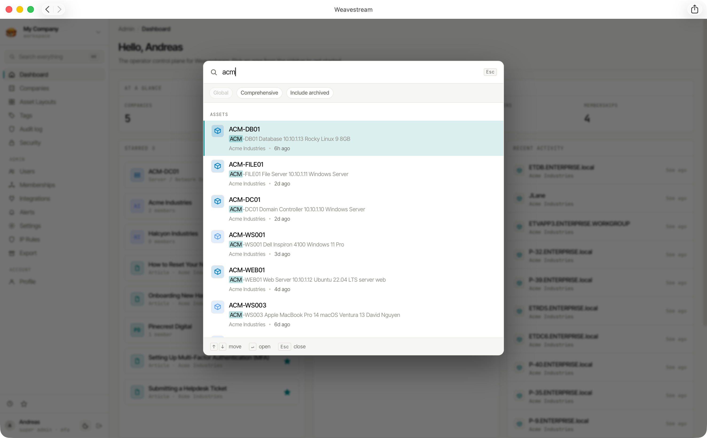

# Search

Weavestream provides full-text search across all documentation content — articles, assets, and uploads — backed by PostgreSQL's native `tsvector` indexing.

## How It Works

A denormalised `SearchIndex` table maintains indexed documents for every searchable entity. When an article, asset, or upload is created or updated, the worker re-indexes the relevant content into this table.

Each index record stores:

- A plaintext representation of the content
- A `tsvector` blob (pre-computed by Postgres)
- Field weights (title: A, body: B)
- Entity type, ID, and tenant scoping

Queries run against the `tsvector` column with GIN indexing for fast lookups.

## Scope & Visibility

Search results are always **scoped to the requesting user's accessible tenants**. A user cannot find records from a tenant they are not a member of. Additionally:

- Fields marked `visibleToClients=false` are stripped from client portal results
- Archived entities are excluded from search results

## Command Palette

Press **Cmd+K** (macOS) or **Ctrl+K** (Windows/Linux) anywhere in the admin interface to open the command palette.

The command palette searches across:

- Articles
- Assets
- Companies (tenants)

### Per-user toggles

Each user can configure the command palette behaviour from their profile:

| Toggle | Options |
|---|---|
| Scope | Current tenant only / All accessible tenants |
| Depth | Recent items only / Comprehensive search |

## Indexed Content

| Entity | What is indexed |
|---|---|
| Articles | Title and body text |
| Assets | All text field values and the asset name |
| Uploads | Filename and attached notes |

Rich-text content (Tiptap JSON) is converted to plaintext before indexing.
