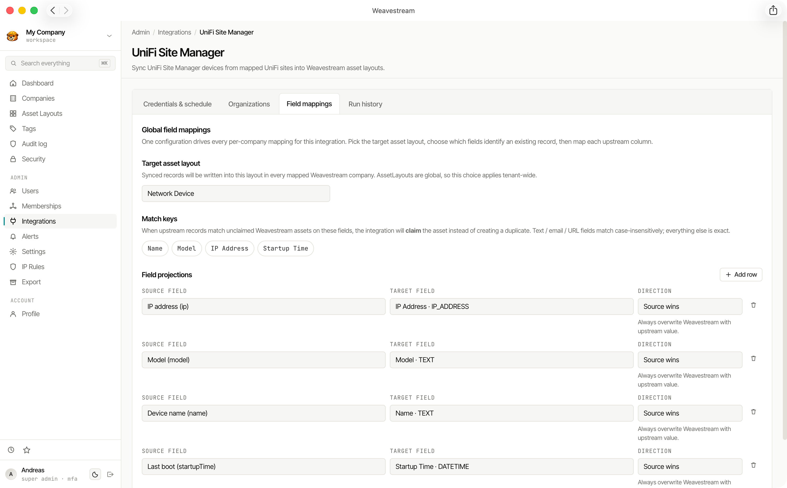

# Integrations Overview

Weavestream's integration layer synchronises asset and infrastructure data from third-party platforms directly into your tenant asset records. A shared sync orchestration engine handles scheduling, conflict detection, field mapping, and error reporting — each provider is implemented as a dedicated driver on top of that foundation.

## Architecture & How It Works

1. **Configure Provider Connections**  
   Operators supply credentials (API tokens, OAuth2 client secrets, service principal keys, or controller URLs) and map source organisations or sites to target Weavestream companies.

2. **Sync Orchestration**  
   Sync jobs run on demand or on a configurable schedule (via UTC cron expressions). The background worker invokes the provider driver to fetch source records, apply field transformations, and upsert records into Weavestream asset layouts.

3. **Review & Monitor**  
   Every sync run records granular status, last-seen timestamps, processed record counts, safe gap reports, and audit trail events on the integration detail page.

## Core Sync Behaviours

- **Upsert Engine** — Records are created on first sync and updated on subsequent runs based on the provider's unique identifier.
- **Soft Staling (No Deletion)** — Records removed or unseen in upstream platforms are flagged as stale rather than deleted, preserving full historical integrity.
- **Granular Audit Log** — Sync runs, field changes, and status transitions write append-only records to the platform audit log.
- **SSRF & Egress Protection** — Outbound integration requests pass through Weavestream's safe fetch layer to guard against SSRF, DNS rebinding, and unauthorized private network access.

## Available Integrations

Select an integration below for provider-specific setup guides, resource capabilities, and field mapping details:

[!card title="Action1" text="Import Windows endpoint records and system hardware telemetry from Action1 RMM into tenant asset records." icon="plug" layout="compact"](/integrations/action1/)

[!card title="Breeze" text="Read-only reconstruction sync for durably importing organization structures, devices, configurations, and topology." icon="plug" layout="compact"](/integrations/breeze/)

[!card title="Cloudflare Zero Trust Lists" text="Manage Cloudflare Zero Trust Gateway IP lists directly from Weavestream with automatic drift detection." icon="plug" layout="compact"](/integrations/cloudflare/)

[!card title="NinjaOne" text="Sync agent-managed workstations, servers, SNMP network gear, and guest VMs with dual-resource mapping." icon="plug" layout="compact"](/integrations/ninjaone/)

[!card title="UniFi" text="Import Ubiquiti UniFi network gateways, switches, access points, and connected client devices into asset records." icon="plug" layout="compact"](/integrations/unifi/)
