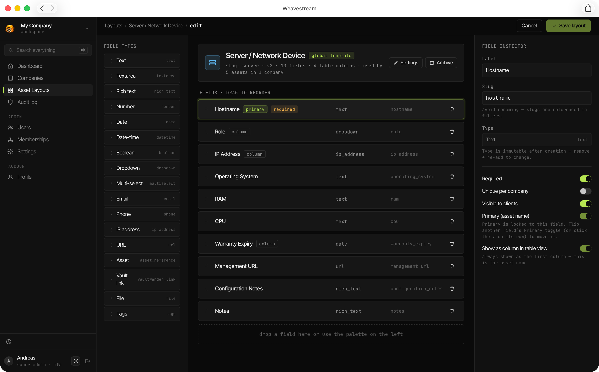
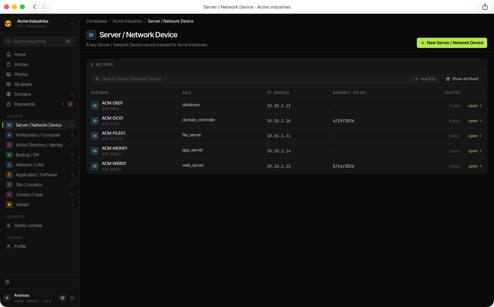
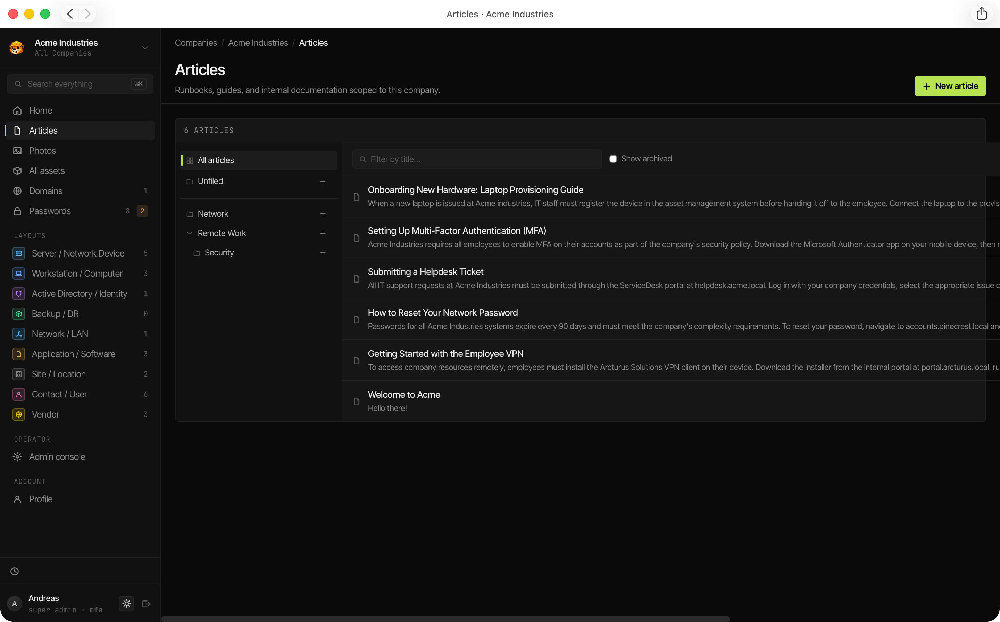
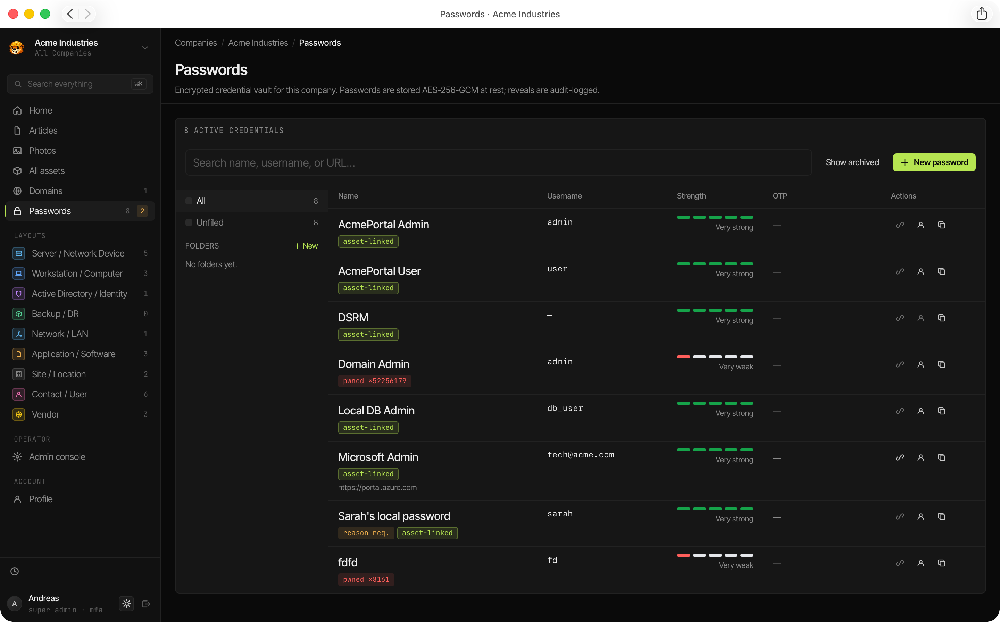

# Key Concepts

Understanding a handful of terms makes the rest of the documentation click into place. This page covers the core entities and how they relate to each other.

## Workspace

The **Workspace** is the singleton instance of Weavestream. There is one workspace per deployment. A `SUPER_ADMIN` configures it from **Admin → Settings**, setting:

- The workspace name and subtitle (shown in the sidebar)
- The **tenant terminology** — the word used everywhere for "tenant" (see below)
- Default password generator settings

The workspace has no bearing on data isolation; it is purely cosmetic configuration.

## Tenant (Company)

A **Tenant** is the primary unit of data organisation in Weavestream. Everything — articles, assets, passwords, domains, uploads — belongs to exactly one tenant.

Tenants are represented in the database as `Company` records. The word shown in the UI is configurable by the operator (see [Workspace Settings](/configuration/workspace-settings/)). Common choices:

| Preset | Typical use case |
|---|---|
| Company | Generic default |
| Client | MSP managing external customers |
| Department | Internal IT team |
| Tenant | Multi-tenanted SaaS |
| Site | Physical location tracking |
| Custom | Any other vocabulary |

Tenants can have a **parent-child hierarchy** (e.g. a parent organisation with subsidiary sites), though cycles are prevented.

## Asset Layout

An **Asset Layout** is a global template that defines the fields available on a type of asset (e.g. _Server_, _Workstation_, _Software License_). Layouts are managed by `SUPER_ADMIN` users and shared across all tenants — individual tenants cannot create their own layouts.

Each layout has a name, an optional icon, and a set of **fields** (see [Asset Fields](#asset-field)).

## Asset

An **Asset** is a single instance of an Asset Layout, belonging to a specific tenant. For example, a layout called _Server_ might have assets named `web-01`, `db-01`, `backup-01`.

Assets support:
- Soft-archive (historical records preserved)
- External ID tracking (for integrations)
- Embedded passwords (credentials linked directly to the asset)
- Cross-references to other assets via `ASSET_REFERENCE` fields

## Asset Field

A **Field** is one attribute on an Asset Layout. Weavestream supports 14 field types:

| Type | Description |
|---|---|
| `TEXT` | Single-line plain text |
| `TEXTAREA` | Multi-line plain text |
| `RICH_TEXT` | Tiptap rich-text editor |
| `NUMBER` | Numeric value |
| `DATE` | Date (with optional expiry tracking) |
| `DATETIME` | Date and time (with optional expiry tracking) |
| `EMAIL` | Email address with `mailto:` link |
| `PHONE` | Phone number |
| `URL` | Hyperlink |
| `BOOLEAN` | Yes / No toggle |
| `DROPDOWN` | Single-select with predefined options (plus optional free-text escape hatch) |
| `MULTISELECT` | Multi-select with predefined options |
| `IP_ADDRESS` | IPv4 or IPv6 address, optional CIDR notation |
| `FILE` | Document or image upload |
| `ASSET_REFERENCE` | Cross-link to another asset |

Fields have additional options: primary designation (highlighted in list views), table-column visibility, per-field client visibility (`visibleToClients`), and uniqueness constraints.

## Article

An **Article** is a rich-text documentation page belonging to a tenant. Articles are authored in the Tiptap editor (tables, images, code blocks, task lists) and organised into **Folders**.

Articles can be marked `visibleToClients` to expose them in the [Client Portal](/features/client-portal/).

## Password

A **Password** is an encrypted credential record belonging to a tenant. Each password stores:

- Name, username, URL
- An AES-256-GCM encrypted secret (the password itself)
- An optional encrypted TOTP secret
- Rich-text or plain-text notes (also encrypted)
- Tags, expiry date, and access restrictions

Passwords maintain a full **version history** — every change is stored as an immutable `PasswordVersion` record.

## Monitored Domain

A **Monitored Domain** is a hostname registered for health tracking. Weavestream checks three things per domain:

- **WHOIS** — domain registration expiry
- **DNS** — resolution validity
- **TLS/SSL** — certificate expiry and chain validity

Results are stored as immutable **Domain Check** records and rolled up in the expiration dashboard.

## Upload

An **Upload** is a file stored in the tenant's directory on disk. Each tenant has an isolated directory (`${FILE_STORAGE_DIR}/<tenantId>/`). Uploads include images (with automatic thumbnail generation), PDFs, documents, archives, and scripts.

## Membership

A **Membership** ties a user to a tenant with a specific role. Users can hold memberships in multiple tenants simultaneously.

| Role | Access |
|---|---|
| `OPERATOR_FULL` | Full read/write within the tenant |
| `OPERATOR_READONLY` | Read-only within the tenant |
| `CLIENT_ADMIN` | Client portal admin |
| `CLIENT_VIEWER` | Client portal read-only |

## Session

A **Session** is a server-side record tracking an authenticated login. Sessions store the user's IP address, user-agent, creation timestamp, and expiry. Revocation is immediate — no offline tokens.

## Audit Log

The **Audit Log** is an append-only record of every mutation in the system. Each entry captures the actor, action, entity type and ID, affected tenant, IP address, user-agent, and before/after JSON blobs.

The audit table is protected at the database-role level: even an `OPERATOR` cannot rewrite history without Postgres superuser access.
